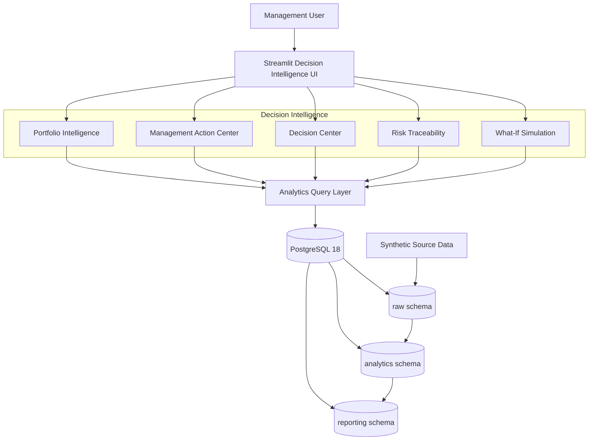

# TransformRisk

## Transformation Risk, Readiness \& Decision Intelligence

TransformRisk is a decision-intelligence platform designed to help management evaluate transformation risk, organizational readiness, control effectiveness, mitigation execution, and portfolio-level management attention before major transformation initiatives proceed.

The platform combines PostgreSQL analytics, explainable risk scoring, readiness assessment, governance decision logic, portfolio prioritization, management action intelligence, risk-control-mitigation traceability, and what-if simulation in an interactive Streamlit application.

> \*\*Data note:\*\* TransformRisk uses synthetic data for demonstration and portfolio analytics. The results are illustrative and do not represent real enterprise decisions.

\---

## Business Problem

Technology and business transformations can fail when organizations focus on implementation without sufficiently evaluating:

\- Residual risk exposure

\- Control coverage and effectiveness

\- Readiness gaps

\- Mitigation execution

\- Overdue actions

\- Dependencies and operational constraints

\- Portfolio-level management attention

TransformRisk converts these signals into structured management intelligence and decision-support outputs.

\---

## Key Decision Questions

TransformRisk is designed around five management questions:

1\. Should the transformation proceed?

2\. What risks require management attention first?

3\. Where are control weaknesses increasing exposure?

4\. Is the organization ready to execute the transformation?

5\. Which initiatives require immediate portfolio-level intervention?

\---

## Core Capabilities

### Transformation Risk Scoring

Each transformation risk is evaluated using:

\- Likelihood

\- Impact

\- Inherent Risk

\- Control Effectiveness

\- Residual Risk

\- Residual Risk Band

Risk bands:

| Score | Band |

|---:|---|

| 1–4 | Very Low |

| 5–8 | Low |

| 9–12 | Medium |

| 13–16 | High |

| 17–25 | Critical |

### Transformation Readiness

Initiatives are assessed across:

\- Technology

\- Data

\- Process

\- People

\- Governance

Readiness bands:

| Score | Band |

|---:|---|

| 80–100 | Ready |

| 65–79 | Ready with Conditions |

| 50–64 | Remediation Required |

| 0–49 | Not Ready |

Both overall readiness and minimum dimension readiness are exposed so capability bottlenecks can be identified.

### Governance Decision Engine

The platform produces prototype governance decisions:

\- \*\*PROCEED\*\*

\- \*\*PROCEED WITH CONDITIONS\*\*

\- \*\*REMEDIATE BEFORE PROCEEDING\*\*

\- \*\*DO NOT PROCEED\*\*

The decision logic considers critical residual risks, high-risk exposure, readiness, overdue mitigation actions, and control effectiveness.

These are prototype analytical policies and should be calibrated against an organization's actual risk appetite before enterprise deployment.

### Portfolio Management Attention

Initiatives receive an analytical priority score from 0–100.

| Dimension | Maximum |

|---|---:|

| Governance Decision | 30 |

| Risk Exposure | 25 |

| Readiness | 20 |

| Execution | 15 |

| Control Environment | 10 |

| \*\*Total\*\* | \*\*100\*\* |

Priority levels:

\- \*\*P1 - Immediate Management Attention\*\*

\- \*\*P2 - Management Action Required\*\*

\- \*\*P3 - Controlled Monitoring\*\*

\- \*\*P4 - Routine Monitoring\*\*

### Management Action Center

The Management Action Center operates at risk level and converts:

\- Residual risk severity

\- Control weakness

\- Mitigation weakness

\- Execution urgency

\- Initiative criticality

into an explainable management priority score.

| Component | Maximum |

|---|---:|

| Residual-risk severity | 30 |

| Control weakness | 20 |

| Mitigation weakness | 20 |

| Execution urgency | 20 |

| Initiative criticality | 10 |

| \*\*Total\*\* | \*\*100\*\* |

Priority drivers are explicitly surfaced, such as:

\- Critical residual risk

\- No mapped controls

\- Weak control effectiveness

\- No mapped mitigation

\- Low mitigation completion

\- Overdue mitigation execution

### Risk → Control → Mitigation Traceability

The platform connects:

\*\*Risk → Control → Mitigation Action\*\*

This identifies:

\- Risks without controls

\- Controls with weak effectiveness

\- Risks without mitigation actions

\- Incomplete treatment coverage

\- Overdue mitigation activities

### What-If Risk Simulation

Users can simulate improvements in control effectiveness and evaluate estimated changes in:

\- Average residual risk

\- Maximum residual risk

\- Risk reduction

\- Risk-band changes

\- Scenario decision implications

Simulation runs in memory and does not modify source data.

\---

## Architecture

### Architecture Layers

| Layer | Responsibility |
|---|---|
| **Presentation** | Streamlit decision-intelligence interface, Power BI  |
| **Decision Intelligence** | Portfolio, risk, readiness, governance and management prioritization |
| **Analytics** | SQL-driven transformations, scoring and summary views |
| **Data** | PostgreSQL raw, analytics and reporting schemas |
| **Source Data** | Reproducible synthetic transformation-risk dataset |

The architecture separates source data, analytical processing, decision logic, and management-facing presentation so that each layer can evolve independently.

---
## License

Copyright (c) 2026 Subhajit Ghosh. All Rights Reserved. This repository is publicly available for portfolio, educational, evaluation, and recruitment purposes. No open-source license is granted. Third-party dependencies remain subject to their respective licenses.
